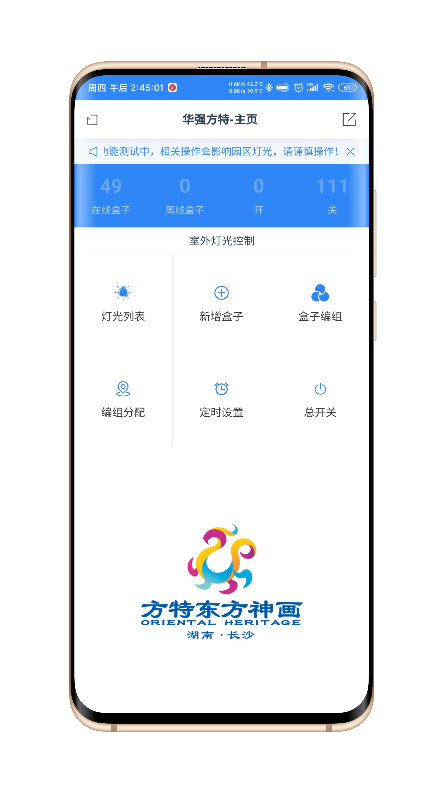
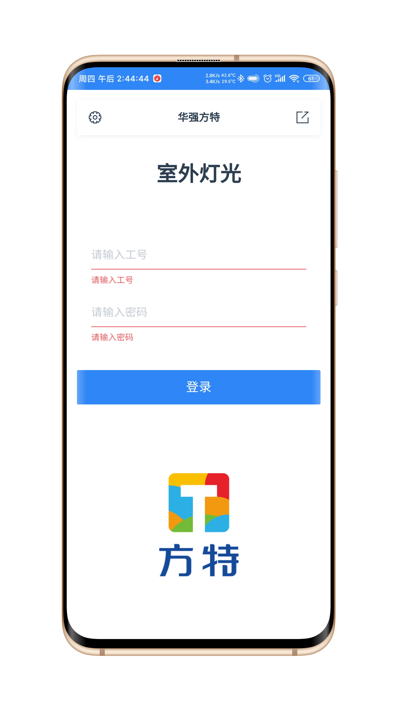
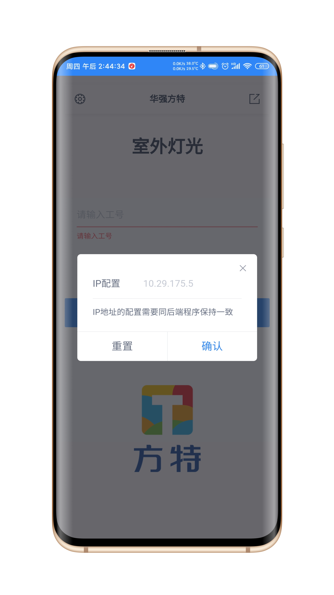
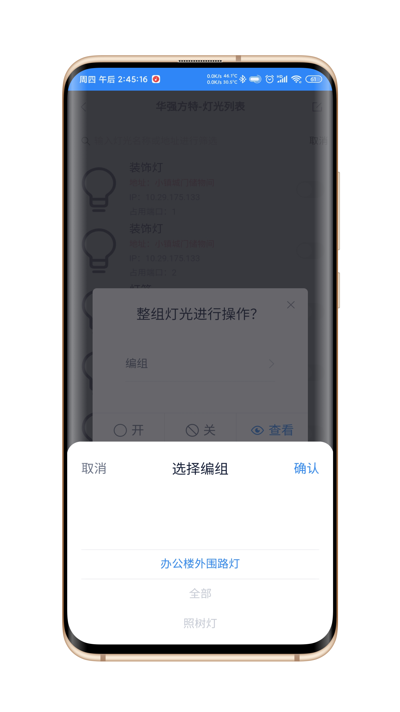
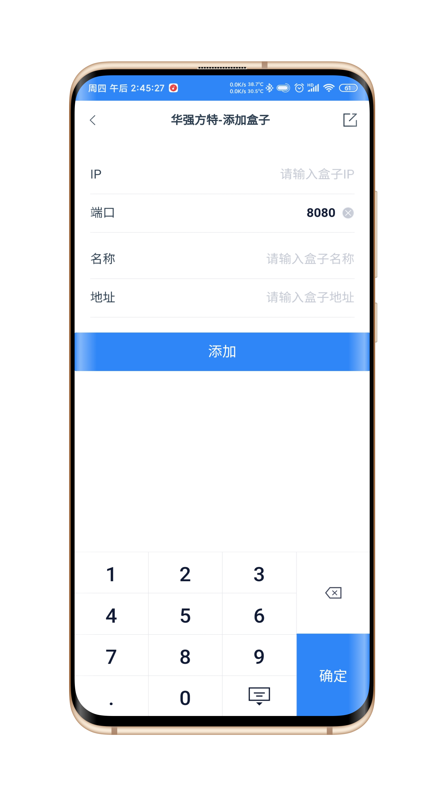
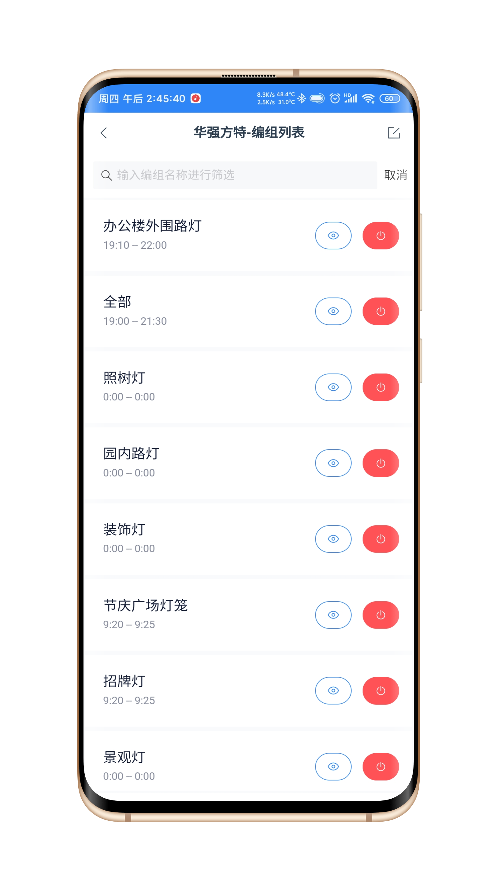
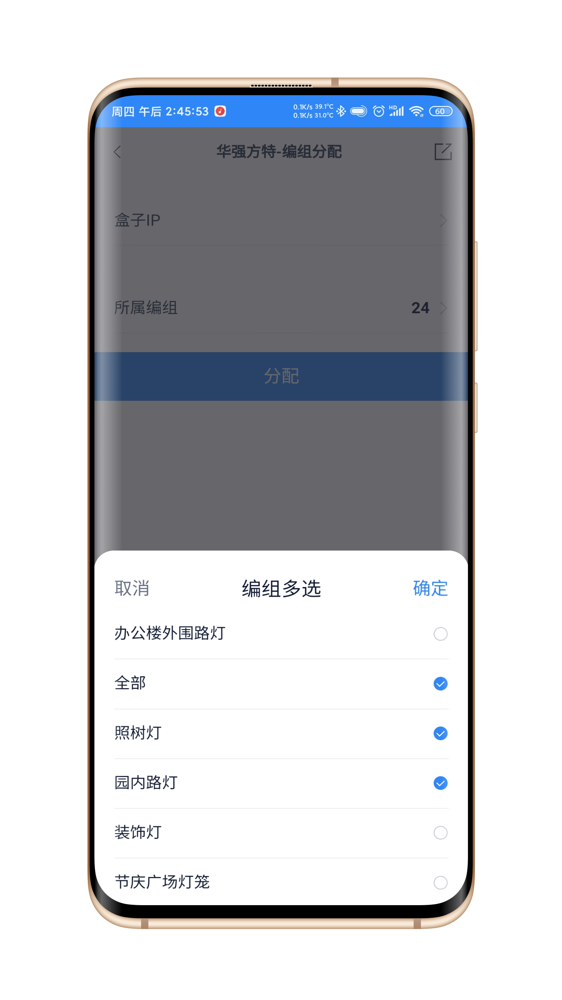
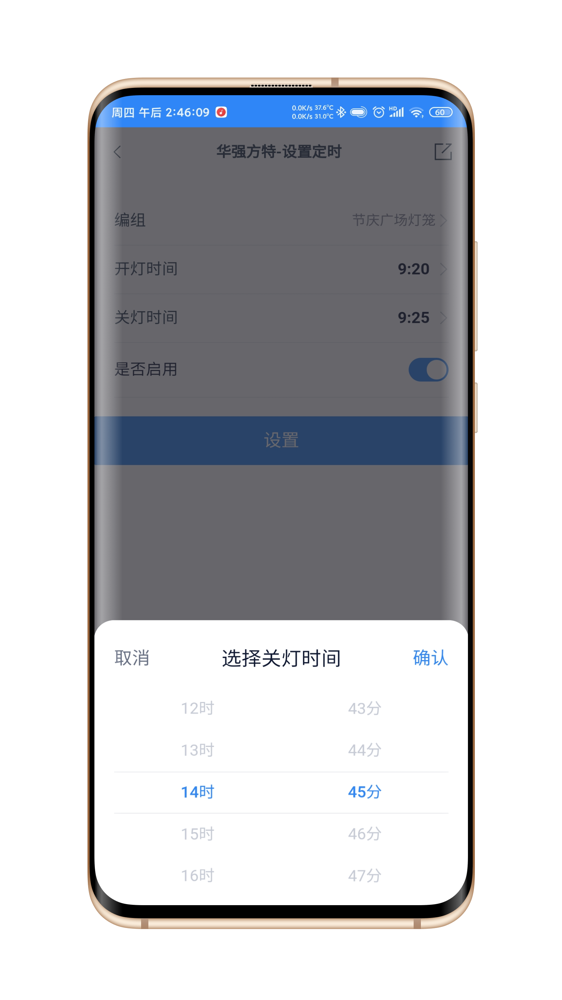
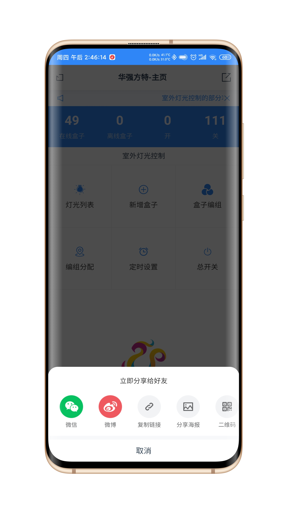

# vue-mobile-本人常用脚手架-web端-安卓端-桌面端


``` bash
## 基础环境
$ npm install

## 调试运行 -> 已配置好断点调试
$ npm run serve

## Web端打包步骤
$ npm run build

## 桌面应用调试运行 -> 已配置好断点调试
$ yarn electron:serve

## 桌面应用打包步骤
$ yarn electron:build

## 安卓打包步骤
$ cd app
$ cordova build android --release
$ cd platforms\android\app\build\outputs\apk\release
$ jarsigner -verbose -sigalg SHA1withRSA -digestalg SHA1 -keystore xuchao.keystore app-release-unsigned.apk xuchao

------------------------------------------------------------------------------------

## 安卓环境的配置及相关指令
$ cordova requirements //环境检查
$ cordova create hqft com.xuchao.hqft lamp //创建项目
$ cordova platform add android //添加android编译环境
$ cordova build android //android环境编译
$ cordova create lamp com.hqft.xuchao hqft
$ cordova build android --release //android环境编译正式发布

## 密钥生成 -> 默认密码：xuchao
$ keytool -genkey -v -keystore xuhcao.keystore -alias xuchao -keyalg RSA -keysize 2048 -validity 10000 //生成安卓密钥
$ jarsigner -verbose -sigalg SHA1withRSA -digestalg SHA1 -keystore xuchao.keystore app-release-unsigned.apk xuchao //签名apk 验证
```

## 脚手架界面
<p align='left'>
   
   
   
   
   
   
   
   
   
</p>